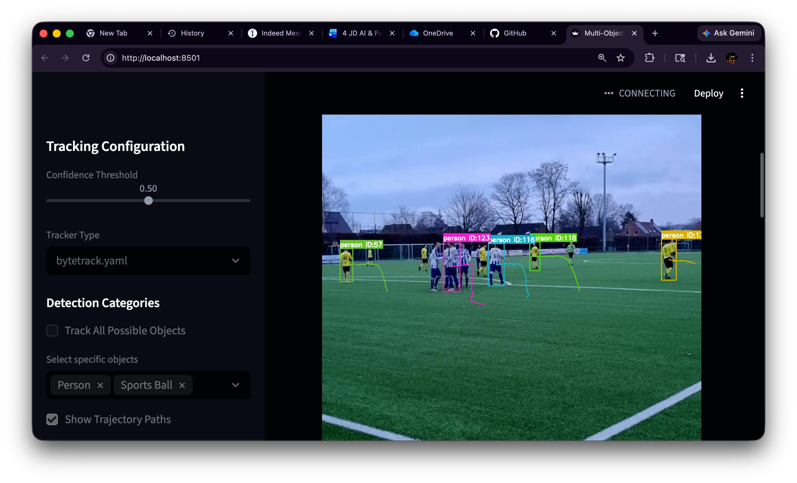

# 🏃 Multi-Object Detection and Persistent ID Tracking

A high-performance computer vision pipeline built with **YOLOv8** and **ByteTrack** for real-time detection and tracking of multiple objects in video streams. This project is specifically designed for sports analytics, event monitoring, and general motion tracking.

## ✨ Key Features
- **Precision Detection**: Powered by Ultralytics **YOLOv8** for state-of-the-art object localization.
- **Persistent Tracking**: Implements **ByteTrack** and **BoTSort** for stable ID persistence across occlusions.
- **Trajectory Mapping**: Automatically visualizes the historical path (trailing tails) of each tracked subject.
- **Interactive Web UI**: A beautiful Streamlit-based dashboard for easy video uploads and parameter tuning.
- **Batch Processing**: Robust Command Line Interface (CLI) for automated workflows.
- **Optimized Performance**: Supports frame-skipping and confidence filtering to balance speed and accuracy.

## 🛠️ Installation

1. **Clone the repository**:
   ```bash
   git clone <repo-url>
   cd multi-object-tracking-project
   ```

2. **Create a virtual environment** (Recommended):
   ```bash
   python -m venv venv
   source venv/bin/activate  # On Windows: venv\Scripts\activate
   ```

3. **Install Dependencies**:
   ```bash
   pip install -r requirements.txt
   ```

## 🚀 How to Run

### 🌐 Option 1: Interactive Web UI (Recommended)
The easiest way to use the model. Launch the browser interface to upload videos and adjust settings dynamically.

```bash
streamlit run src/app.py
```

- **Sidebar Settings**: Adjust confidence thresholds, select specific object classes (e.g., "Person", "Sports Ball"), and toggle trajectory paths.
- **Real-time Preview**: Watch the tracking process frame-by-frame.
- **Results**: View and play the final annotated video directly in your browser.

### 💻 Option 2: Command Line Interface
Ideal for batch processing or server-side automation.

```bash
python src/main.py --input data/sample_video.mp4 --output outputs/result.mp4 --confidence 0.5 --show_paths
```

#### CLI Arguments:
| Argument | Description | Default |
| :--- | :--- | :--- |
| `--input` | Path to the input video file. | **Required** |
| `--output` | Path where the annotated video will be saved. | **Required** |
| `--confidence` | Confidence threshold for the YOLO detector (0.0 to 1.0). | `0.5` |
| `--tracker` | Tracking algorithm configuration (`bytetrack.yaml` or `botsort.yaml`). | `bytetrack.yaml` |
| `--frame_skip` | Number of frames to skip to increase processing speed. | `0` |
| `--classes` | Space-separated COCO class IDs to track (e.g., `0 32`). | `None` (Tracks all) |
| `--show_paths` | Flag to enable drawing of trajectory paths for each ID. | `False` |

## 📂 Directory Structure
- **`src/`**: Contains the core logic (`main.py`, `detector.py`, `tracker.py`, `annotate.py`, `utils.py`).
- **`data/`**: Place your raw input videos here.
- **`outputs/`**: Final processed videos are saved here.
- **`models/`**: Stores downloaded YOLOv8 model weights.
- **`screenshots/`**: Visual samples and documentation.

## 📊 Visual Preview


---
*Built with Ultralytics YOLOv8 and Streamlit.*
